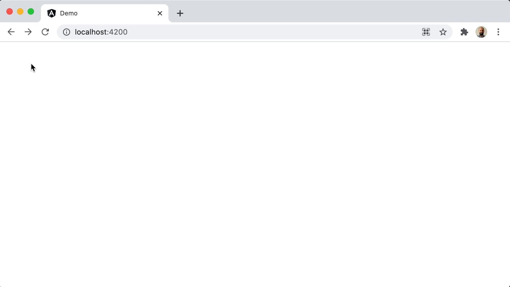

# Ng101

This project was generated with [Angular CLI](https://github.com/angular/angular-cli) version 11.2.7.

## Log

### How this workspace was generated

```sh
npx @angular/cli new ng101 --directory=angular-101 --package-manager=yarn --strict --create-application=false
```


### How demo app was generated

```sh
yarn ng generate application demo --routing --style=scss
```


### What demo app initially looked like

```sh
yarn start --open
```


### How Angular Material was added

```sh
yarn ng add @angular/material
```


### How unit tests are run

```sh
yarn test
```


**Note:** Karma was [configured to run on headless Chrome](projects/demo/karma.conf.js#L40). The default setup would open a new Chrome instance.

### How lazy-loaded module was added

```sh
yarn ng g module todo-list --module=app --route=todo-list
```


**Note:** `g` is the short alias for `generate`.

### How to generate a layout

```sh
# first create the module
yarn ng g module layouts/main-layout --module=todo-list/todo-list

# then create the component
yarn ng g component layouts/main-layout/main-layout --export --change-detection=OnPush --flat
```


**Note 1:** [Configured todo list routing](projects/demo/src/app/todo-list/todo-list-routing.module.ts) to have nested routes.

**Note 2:** Obviously, [some styles](projects/demo/src/app/layouts/main-layout/main-layout.component.scss) as well as [Material components](projects/demo/src/app/layouts/main-layout/main-layout.component.html) were used to get that result.

### How to customize Material theme

```scss
@import "~@angular/material/theming";

$app-primary: mat-palette($mat-blue-grey, 900);
$app-accent: mat-palette($mat-yellow, 700);
$app-warn: mat-palette($mat-red, 600);
$app-theme: mat-light-theme(
  (
    color: (
      primary: $app-primary,
      accent: $app-accent,
      warn: $app-warn,
    ),
  )
);
```


**Note 1:** Material has [over 900 free icons](https://fonts.google.com/icons?selected=Material+Icons) and, when required, [custom icons can be registered](projects/demo/src/app/layouts/main-layout/main-layout.component.ts) via a service.

**Note 2:** Angular protects us against XSS attacks. Custom SVG source could be registered only after [explicit trust was granted](projects/demo/src/app/layouts/main-layout/main-layout.component.ts).

### How linter is run

```sh
yarn lint
```


**Note:** TS Lint is deprecated and is expected to be replaced by Angular team.

### How mock library was generated

**Important:** This step is not needed when developing Angular apps with a backend.

```sh
yarn ng g library mock --entry-file=index --skip-package-json
```


### How MSW and PouchDB were integrated

**Important:** This step is not needed when developing Angular apps with a backend.

1. Installed [dependencies](package.json).
2. Added pouchdb to [script injected by Angular](angular.json#L39) when app is built.
3. Used MSW CLI to create [mockServiceWorker.js](projects/demo/src/mockServiceWorker.js) and [added the generated file to assets](angular.json#L32).
4. Created [models and request handlers](projects/mock/src/lib).
5. Initiated msw [only in development](projects/demo/src/environments/environment.ts).


**Note:** Using MSW is a personal preference. There are other mocking options such as [Angular in-memory-web-api](https://github.com/angular/angular/tree/master/packages/misc/angular-in-memory-web-api) or providing mock services with dependency injection.

### How AsyncPipe, ngIf, nfFor, and ngClass works

```html
<mat-card>
  <mat-selection-list *ngIf="list$ | async as list; else spinner">
    <mat-list-option [selected]="todo.done" *ngFor="let todo of list.rows">
      <span [ngClass]="{ done: todo.done }">{{ todo.title }}</span>
    </mat-list-option>
  </mat-selection-list>

  <ng-template #spinner>
    <div class="spinner">
      <mat-spinner diameter="60" color="accent"></mat-spinner>
    </div>
  </ng-template>
</mat-card>
```



### How to execute async operations before initialization

The mock DB implementation so far has an error. When site data is cleared and the page is refreshed, the first response is empty.


This is due to lack of proper asynchronous initialization. `APP_INITIALIZER` serves that purpose.

```ts
{
  provide: APP_INITIALIZER,
  useFactory: () => {
    return async () => {
      await seedDb();
      worker.start();
    };
  },
  multi: true,
}
```


## Development

### Development server

Run `ng serve` for a dev server. Navigate to `http://localhost:4200/`. The app will automatically reload if you change any of the source files.

### Code scaffolding

Run `ng generate component component-name` to generate a new component. You can also use `ng generate directive|pipe|service|class|guard|interface|enum|module`.

### Build

Run `ng build` to build the project. The build artifacts will be stored in the `dist/` directory. Use the `--prod` flag for a production build.

### Running unit tests

Run `ng test` to execute the unit tests via [Karma](https://karma-runner.github.io).

### Running end-to-end tests

Run `ng e2e` to execute the end-to-end tests via [Protractor](http://www.protractortest.org/).

### Further help

To get more help on the Angular CLI use `ng help` or go check out the [Angular CLI Overview and Command Reference](https://angular.io/cli) page.
